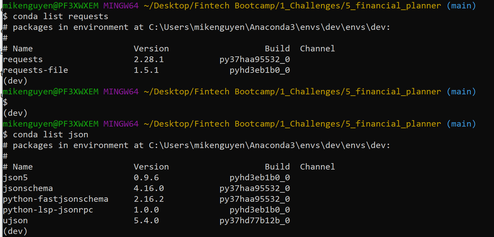
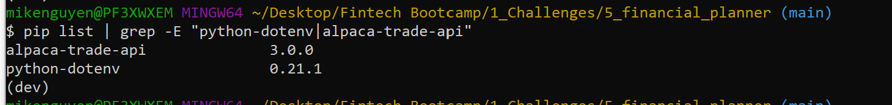

# Financial Planner

This Jupyter notebook contains code that helps credit union members evaluate their financial health through two financial planning tools: 

(1) A financial planner for emergencies. The members will be able to use this tool to visualize their current savings. The members can then determine if they have enough reserves for an emergency fund.

(2) A financial planner for retirement. This tool will forecast the performance of their retirement portfolio in 30 years. To do this, the tool will make an Alpaca API call via the Alpaca SDK to get historical price data for use in Monte Carlo simulations.

## Technologies

Programming Language: `Python 3.7.13`

Interactive Development Environment: `JupyterLab`


Libraries: 
- `pandas` - A Python library that is used for data manipulation, analysis, and visualization. 
- `os` - A Python standard utility module which provides functions for interacting with the computer's operating system.
- `requests` - A Python library helps you access data via APIs
- `json` - A Python library puts the response (that is, data) from an API into human-readable format.
- `dotenv` - A Python library that allows you to load environment variables from a file called .env into your Python project. Environment variables are typically used to store sensitive information such as API keys, database credentials, and other secrets that you do not want to hardcode into your project.
- `alpaca_trade_api` - The Alpaca Trade API is a commission-free trading API that allows developers to programmatically access and interact with the financial markets. The API provides real-time market data, as well as the ability to execute trades and manage portfolios.
- `warnings` - A Python library that provides a way to handle warning messages that may occur during the execution of a program.
- `matplotlib` - A Python for creating static, animated, and interactive visualizations in Python. It provides a wide variety of customizable visualizations, including line plots, scatter plots, bar plots, histograms, heatmaps, and more.


Operating System(s):  Any operating system that supports Python, including Windows & macOS.

## Installation Guide

To run this analysis, make sure you install the necessary dependencies:

1. Install `Python`: `https://www.python.org/downloads/`
2. Install and run `Jupyter Lab`: `https://jupyter.org/install`
3. Install the necessary libraries using pip, the package installer for Python:
```
pip install pandas MCForecastTools matplotlib
```
4. Install the `Requests` library, check that your development environment is active, and then run the following command:
```
conda install -c anaconda requests
```
5. Install the `JSON` library, check that your development environment is active, and then run the following command:
```
conda install -c jmcmurray json
```
6. Install the `python-dotenv` Library. With the python-dotenv library, you can read key-value pairs from an environment file `(.env)` and add them as environment variables. To install this library, run the following command in your terminal:
```
pip install python-dotenv
```
7. Install the `Alpaca SDK`. Alpaca is an API for stock trading. With the Alpaca SDK, you can interact with the Alpaca API. To install this SDK, run the following command in your terminal:
```
pip install alpaca-trade-api
```
8. Verify the installations. 

The `Requests` and `JSON` libraries get installed with Anaconda. To confirm their installation, do the following: 

In the terminal, activate the Conda development environment, and then run the following code:
```
conda list requests

conda list json
```
The result on your screen should resemble the following image:


To verify that the library and SDK installations completed, call the `pip list` function together with the `grep -E` argument, which enables plain-text searches via the command line. The following code shows this function call:
```
pip list | grep -E "python-dotenv|alpaca-trade-api"
```
The result on your screen should resemble the following image:



## Usage

1. To get started with this project, you will need to set up an Alpaca Trade API account and obtain your API keys. You can do this by following the instructions on the Alpaca Trade API website. Once you have your API keys, create a .env file in the root directory of the project and add the following lines, replacing YOUR_API_KEY and YOUR_SECRET_KEY with your actual API keys:

```
ALPACA_API_KEY= "<YOUR_API_KEY>"
ALPACA_SECRET_KEY= "<YOUR_SECRET_KEY>"
```

2. Clone the repository: `git clone "https://github.com/mikenguyenx/5_financial_planner"` using git or download the ZIP file and extract it to a local directory.
3. Open a terminal or command prompt and navigate to the directory with the application.
4. Launch Jupyter Lab: `jupyter lab`
5. Open `financial_planning_tools.ipynb` in Jupyter Lab.
6. Run the code cells by clicking on the run button or by pressing the `Shift + Enter` key combination to load and preprocess the data, and generate visualizations
7. Use the Alpaca Trade API to retrieve real-time market data and the MCForecast Tools library to perform Monte Carlo simulations as part of the financial planning tools provided to evaluate financial plans for both emergencies and retirement.

Below are screenshots of examples of results from the analysis:

### 30-Year Monte Carlo Simulation Line Plot 


### Probability Distribution of Monte Carlo Simulation 


## Contributors

Mike Nguyen

Email: nguyen.mikeq@gmail.com

LinkedIn: https://www.linkedin.com/in/mike-nguyen-6899554/

## License

MIT License

